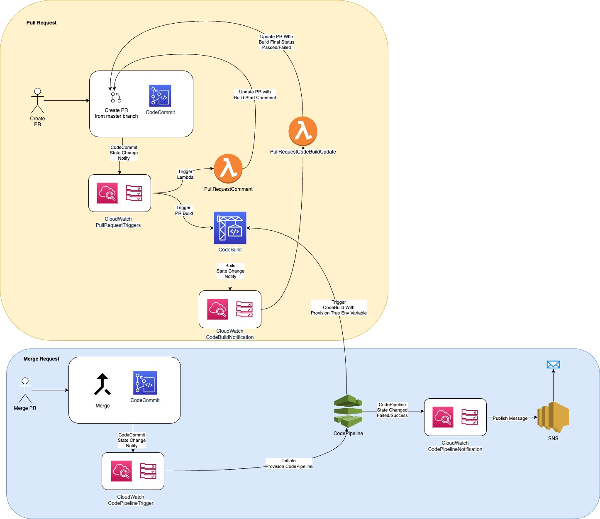

# AWSCodeCommitPRCodeBuild
Cloudformation code for building infrastructure to establish CICD workflow using CodeCommit.

# Purpose
Review and Validate code changes before it is merged with the master branch and applied to Snowflake Account. one of the main requirements we see is a strong emphasis on automation of delivering resources in a safe, secure, and repeatable manner. One of the fundamental principles of CI/CD is aimed at keeping everyone on the team in sync about changes happening in the codebase. With this in mind, it’s important to fail fast and fail early within a CI/CD workflow to ensure that potential issues are caught before making their way into production.

# High Level DevOps Recommendation
The following diagram shows the workflow of a pull request. The AWS CodeCommit repository contains one branch called master, any changes performed to master branch is through a pull request.

In this workflow, a pull request is created with the new code in the master branch, which the developer wants to merge into the master branch. The creation of the pull request is an event detected by AWS CloudWatch. This event will start two separate actions:

-   It triggers an AWS Lambda function that will post an automated comment to the pull request that indicates a build to test the changes is about to begin.

-   It also triggers an AWS CodeBuild project that will build and validate those changes.

When the build completes, AWS CloudWatch detects that event. Another AWS Lambda function posts an automated comment to the pull request with the results of the build and a link to the build logs. Based on this automated testing, the developer who opened the pull request can update the code to address any build failures, and then update the pull request with those changes. Those updates will be built, and the build results are then posted to the pull request as a comment.

Testing and validating pull requests before they can be merged into production code is a common approach and a best practice when working with CI/CD. Once the pull request is approved and merged into the master branch, it is also a good CI/CD practice to automatically build, test, and deploy that code, as part of this workflow AWS CloudWatch detects change in master branch and calls AWS CodePipeline which start the final provisioning build. Status of AWS CodePipeline is emailed to registered team DL.